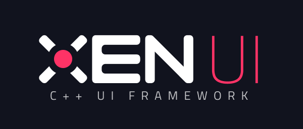

    

**Xen UI** is a C++ UI framework for Windows. It uses Direct2D under the hood to provide GPU accelerated
rendering. Xen follows a very similar design ethos to Flutter without the requirement of a second
programming language.

## Status

Not even remotely close to usable. Check back in a year.