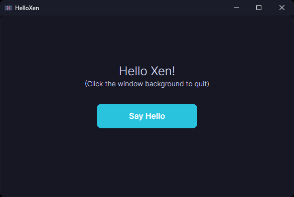

<p align="middle">
    
</p>

**Xen UI** is a C++ UI framework for Windows. It uses Direct2D under the hood to provide GPU accelerated
rendering. Xen follows a very similar design ethos to Flutter without the requirement of a second
programming language.

## Example

Here's a snippet of the `XenApp::BuildUI()` method used to create the UI of the application, pulled
from the [HelloXen](Demos/HelloXen/main.cpp) demo:

```cpp
void HelloXen::BuildUI() {
    // Reset UI elements
    // NOTE: Should always be called and always at the top of BuildUI()
    XenApp::BuildUI();

    const auto btnRect = Rect::FromCenter(Window->GetWindowCenter().Translate(0.f, 20.f), 200, 48);
    btnText            = new Text("Say Hello",
                       Context.FontFamily,
                       Window->GetWindowCenter(),
                       btnRect,
                       0,
                       nullptr,
                       600,
                       16.f,
                       Context.AppTheme.White);
    btnBox             = new Box(btnRect, Context.AppTheme.Tertiary, 1, btnText, [&]() {
        ::MessageBoxA(Window->GetHandle(), "Hello!", "HelloXen", MB_OK | MB_ICONINFORMATION);
    });
    helloText =
      new Text("Hello Xen!",
               Context.FontFamily,
               Window->GetWindowCenter(),
               Rect::FromPoints({0, 0}, Window->GetDimensions().AsOffset().Translate(0.f, -140.f)),
               0,
               btnBox,
               300,
               24.f,
               Context.AppTheme.TextHighlight);
    hintText =
      new Text("(Click the window background to quit)",
               Context.FontFamily,
               Window->GetWindowCenter(),
               Rect::FromPoints({0, 0}, Window->GetDimensions().AsOffset().Translate(0.f, -90.f)),
               0,
               helloText,
               300,
               14.f,
               Context.AppTheme.TextHighlight);
    appBackground = new Box(Rect::FromPoints({0, 0}, Window->GetDimensions().AsOffset()),
                            Context.AppTheme.FrameBackground,
                            0,
                            hintText,
                            [] { ::PostQuitMessage(0); });

    AttachRootElement(appBackground);
}
```

This produces the following application window:

<p align="middle">
    
</p>

## Status

Not even remotely close to usable. Check back in a year.